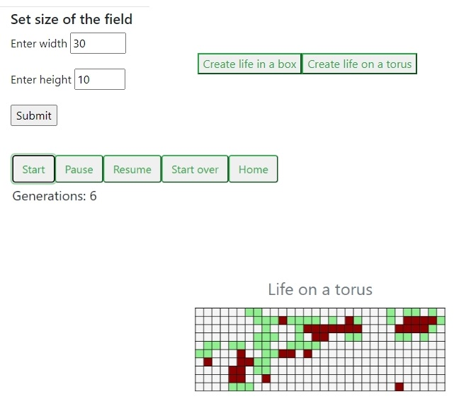

# ProjectLife

{width=50%} 

## Table of contents
* [General info](#general-info)
* [Technologies](#technologies)
* [Setup](#setup)

## General info

This is a training project in the Flask learning course. The project realizes the [Game of Life](https://en.wikipedia.org/wiki/Conway%27s_Game_of_Life) (GoF) in a browser. Two versoins are realized: (i) life in a box and (ii) life on a thorus. They differ by the way how the number of cell's neighbours is calculated.  

## Technologies
Project is created with:
* Python 3.9.13 
* Flask==2.3.2
* Jinja2==3.1.2
It was tested in a browser 
* Microsoft Edge Version 114.0.1823.43 (Official build) (64-bit)

## Setup
Clone this repo to your desktop or download zip and unpack

## Usage
After you clone this repo to your desktop,   run pip install -r requirements.txt
to install all the dependencies.

Once the dependencies are installed, you can run app.py file to start the application. You will then be able to access it at localhost:5000